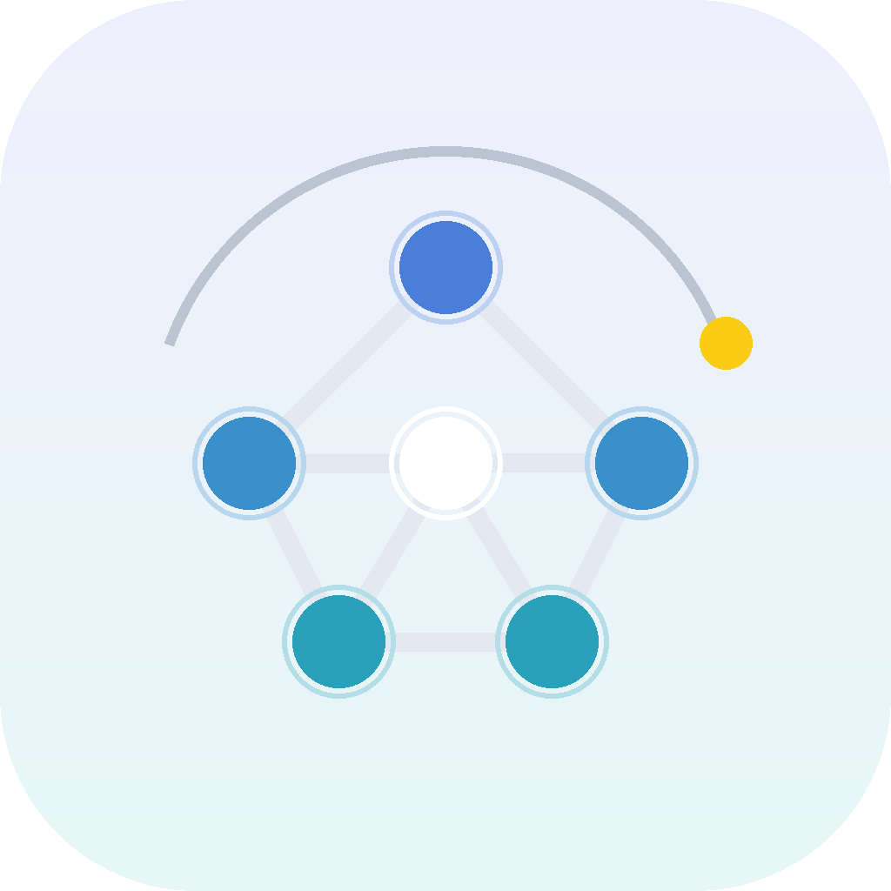

<div align="center">



# NovaMind AI

**Your private AI assistant. On-device intelligence meets cloud power.**

Built with React Native. Chat with AI two ways: fully offline with models that live on your phone, or through the cloud via any OpenAI-compatible endpoint. Your conversations, your rules.

[](LICENSE)
[](#-get-started)
[](https://reactnative.dev)
[](https://github.com/mirzasayzz/novamind-ai/fork)

</div>

---

## Why NovaMind?

Most AI apps make a choice for you: either everything goes to someone else's server, or you're stuck with tiny models. NovaMind refuses that trade-off:

- **🔒 Private by default** — run GGUF models (Gemma, Qwen, Phi, Llama and more) fully on-device. No account, no cloud, no internet needed.
- **☁️ Cloud when you want it** — connect any OpenAI-compatible endpoint. Ships with built-in support for **AgentRouter**: add your URL and key in `.env` and cloud models appear in the model picker automatically.
- **🎭 NovaHub personas** — create personalized assistants with their own model, system prompt, and personality, and share them with the community.
- **🗣️ On-device voices** — neural text-to-speech (Kokoro, Supertonic and more) with no cloud calls.
- **🛠️ Tool use** — assistants can call built-in tools (calculator, date/time, web search, rich HTML rendering) inside an agent loop.
- **📥 Hugging Face built in** — search and download GGUF models directly, including gated repos with your access token.
- **📊 Benchmarks** — measure tokens/sec and memory use on your hardware.
- **⚡ Hardware accelerated** — CPU, GPU (Metal on iOS, OpenCL/Adreno on Android) and NPU (Hexagon) inference paths.
- **🌍 Localized** — 11 languages, phones and tablets, full iPad support.

## Architecture

NovaMind is a four-layer stack, from silicon up to chat UI:

| Layer | What runs here |
| --- | --- |
| **UI & Tools** | React Native app (Paper UI, MobX, WatermelonDB). The `AgentRunner` drives each turn: streaming tokens, dispatching tools, feeding results back. |
| **Bridging** | Native modules connecting JS to engines: [`llama.rn`](https://github.com/mybigday/llama.rn) over JSI for LLMs, ONNX Runtime + speech bridges for voices. |
| **Engine** | llama.cpp for quantized GGUF models, ONNX Runtime for voice models. |
| **Hardware** | CPU, GPU (Metal / OpenCL), NPU (Qualcomm Hexagon), with graceful fallback. |

## Get Started

### Try it on your phone

```bash
# 1. Clone and install
git clone https://github.com/mirzasayzz/novamind-ai.git
cd novamind-ai
yarn install

# 2. Configure your environment
cp .env.example .env
# Edit .env: add AGENTROUTER_BASE_URL + AGENTROUTER_API_KEY for cloud AI,
# or leave them empty for a fully offline app.

# 3a. Run on Android
yarn android

# 3b. Or on iOS
cd ios && pod install && cd ..
yarn ios
```

First launch: download a model from **Menu → Models** (or add one from Hugging Face), tap **Load**, and start chatting. If you configured a cloud endpoint, its models show up in the picker with no download needed.

### Cloud AI via AgentRouter

NovaMind auto-seeds any OpenAI-compatible endpoint you configure:

```env
AGENTROUTER_BASE_URL=https://your-endpoint.example.com/v1
AGENTROUTER_API_KEY=your-key-here
```

Keys live only in your `.env` and the device Keychain, never in the codebase. Point `AGENTROUTER_BASE_URL` at OpenAI, Groq, Ollama, LM Studio, llama.cpp server, vLLM or anything else that speaks the OpenAI protocol.

<div align="center">
<sub>Made with React Native. If NovaMind is useful to you, consider giving it a ⭐ — it helps others find the project.</sub>
</div>
